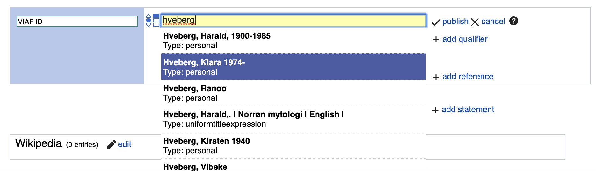

# Wikidata autocomplete gadget for external-id properties

* The `gadget` folder contains a Wikidata gadget that provides entityselector-like
  autocomplete for external-id properties like [VIAF](https://www.wikidata.org/wiki/Property:P214).

* The `server` folder contains a small backend service for Toolforge, that queries
  the actual external search endpoints. A proxy was needed to avoid CORS and privacy issues.

Phabricator: https://phabricator.wikimedia.org/T223776

